# eQuis Social Network

## 👥 Miembros del Equipo
| Nombre y Apellidos | Correo URJC | Usuario GitHub |
|:--- |:--- |:--- |
| David Paul Limaylla Ticlavilca | dp.limaylla.2021@alumnos.urjc.es | DavidPaul-LT |
| Elena Ceinos Abeijón  | e.ceinos@alumnos.urjc.es | elenacabe |
| Sergio Rodríguez Gil | s.rodriguezgi.2021@alumnos.urjc.es | NeoDaru |
| Alvaro Sepulveda Crespo | a.sepulvedac.2018@alumnos.urjc.es | alvaro-sepu |
| Cassiel Seth Mayorca Heirisman | cs.mayorca.2018@alumnos.urjc.es | Cassiel123 |

---

## 🎭 **Preparation 1: Project Description**

### **Descripción del Tema**
This project consists of a web-based social network focused on user interaction through posts and comments, allowing users to express their ideas and communicate with others on the platform.

Users can create text-based posts with optional images, comment on posts, and interact through likes. Content is organized into fixed categories managed by the administrator and dynamic tags created by users, providing structured yet flexible navigation.
A general feed prioritizes posts based on user interaction and recency, improving content visibility and engagement.

### **Entities**

1. **[Entidad 1]**: User
1. **[Entidad 3]**: Post
1. **[Entidad 4]**: Comment
1. **[Entidad 5]**: Category


**Relaciones entre entidades:**
- [User – Post] A user can create 0..n posts, and each post belongs to a single user (1:N).
- [User – Comment] A user can create 0..n comments, and each comment belongs to a single user (1:N).
- [Post – Comment] A post can have 0..n comments, and each comment belongs to a single post (1:N).
- [Category – Post] A category can contain 0..n posts, and each post belongs to a single category (1:N).

### **User Permissions**

* **Anonymous User**: 
  - Permissions: View posts and comments, register in the application, 
  - Owns no entities

* **Registered User**: 
  - Permissions: Create posts, Comment on posts, Edit their profile (image, name, and biography, password), Edit their own comments, Delete their own posts and comments, Give and remove likes from posts
  - Owns: Their profile, Their posts, Their comments, Their likes

* **Admins**: 
  - Permissions: Block and unblock users, Delete any post, Delete any comment, View global application statistics. Inherits the functions of the registered user, create, delete, and modify category
  - Owns: Inherits the owns of the registered user

### **Images**

- **[Entidad con imágenes 1]**: User
- **[Entidad con imágenes 2]**: Post
- **[Entidad con imágenes 3]**: Comment
- **[Entidad con imágenes 4]**: Category

### **Charts**

- **Chart 1**: Posts with the most likes — Bar chart

### **Complementary Technology**
- Automatic email sending (e.g., registration confirmation or user block notification) using JavaMailSender

### **Algorithm or Advanced Query**

- **Post Ranking Algorithm**: The general feed and category feeds are generated using a scoring algorithm based on user interaction and time. Score = (Likes × 3) + (Comments × 2) − (Hours since creation × 0.1)

- **Description**: This algorithm prioritizes posts with higher interaction (likes and comments) while still considering recency. As a result, relevant and active posts gain visibility without excluding newly created content. Deleted posts are excluded from the feed.


---

## 🛠 **Preparación 2: Maquetación de páginas con HTML y CSS**

### **Vídeo de Demostración**
📹 **[Enlace al vídeo en YouTube](https://www.youtube.com/watch?v=x91MPoITQ3I)**
> Vídeo mostrando las principales funcionalidades de la aplicación web.

### **Navigation Diagram**
Diagram showing how to navigate between the different pages of the application:


### **Screenshots and Page Description**

#### **1. Main Page / Home**

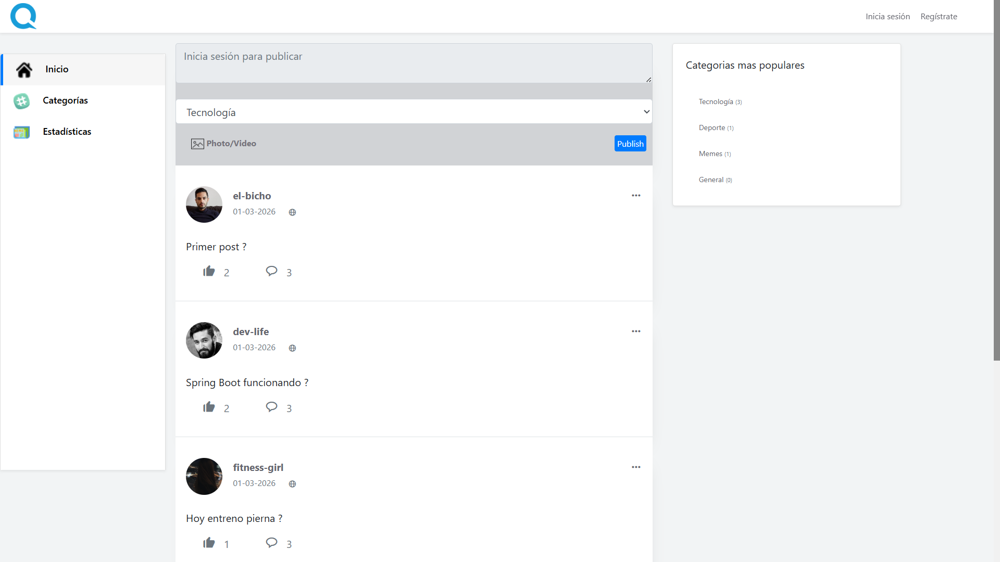

> The home page displays posts along with their respective comments. From this page, you can access the admin page (if you are an admin), the profile page (if you have logged in), the categories page, and the statistics page. You can also create posts or comments from this page.

#### **2. Login Page**

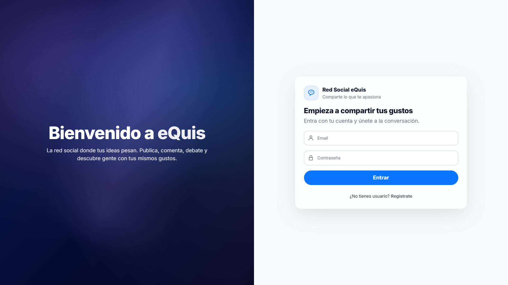

> This page allows the user to login as a normal user or an admin, and it also has a link to register yourself in the app.

#### **3. Register Page**

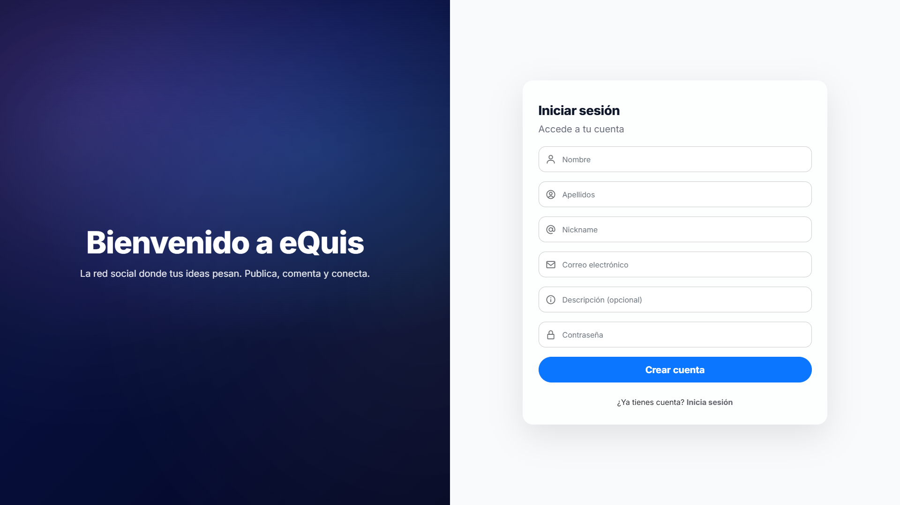

> This page allows the user to register in the app, and it also has a link to the login page.

#### **4. Statistics Page**

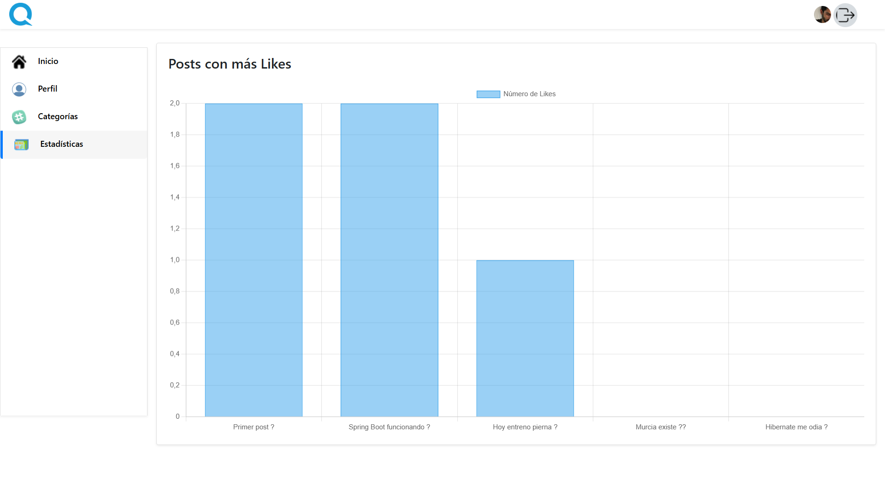

> This page shows the top five posts with the highest number of likes.

#### **5. Profile Page**

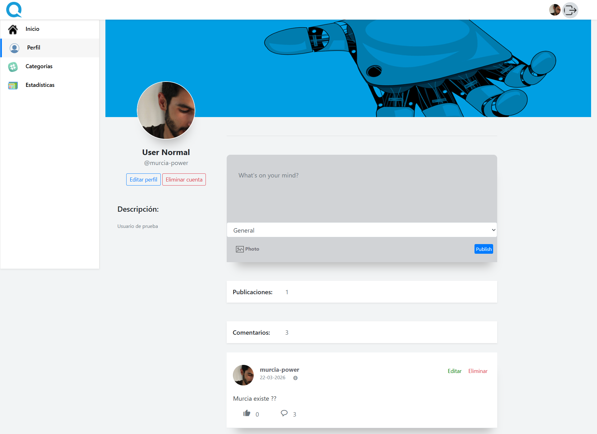

> This page shows the logged in user data, and allows the user to edit their profile, publish a post, or delete their profile.

#### **6. Edit Profile Page**

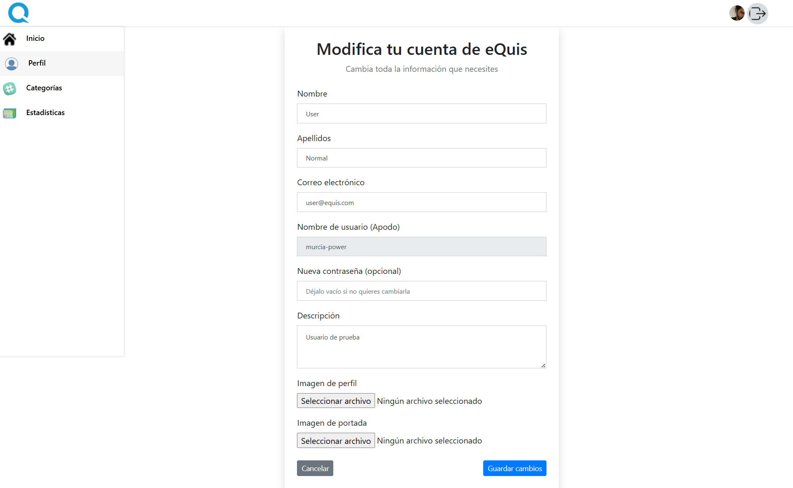

> This page allows the user to edit specific data of their profile.

#### **7. Admin Page**

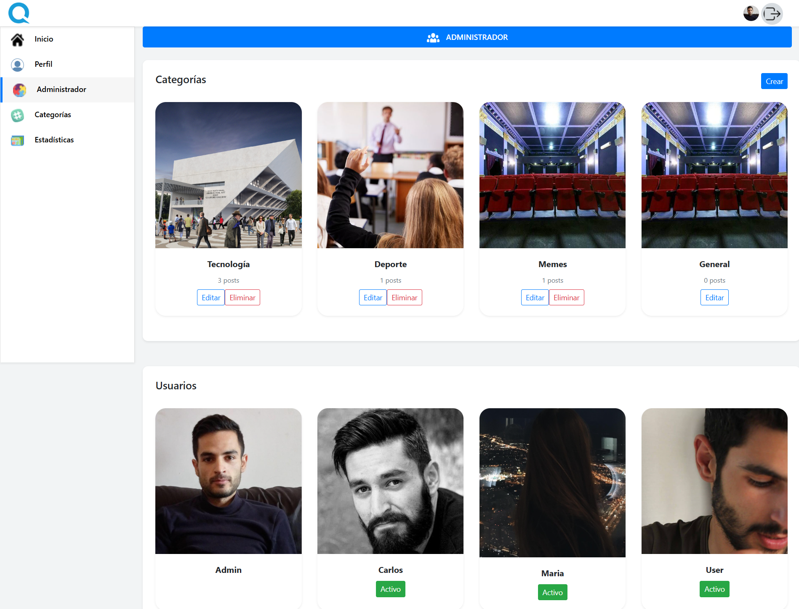

> This page shows the admin the users and categories in the app; and the option to create, delete or edit categories, and block or unblock users.

#### **8. Create Category Page**

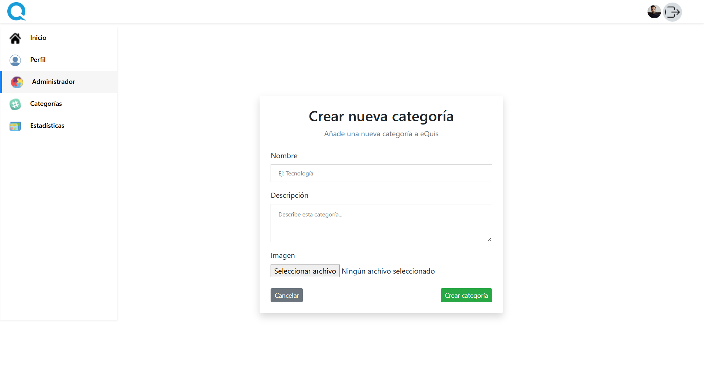

> This page allows the admin to create a new category.

#### **9. Edit Category Page**

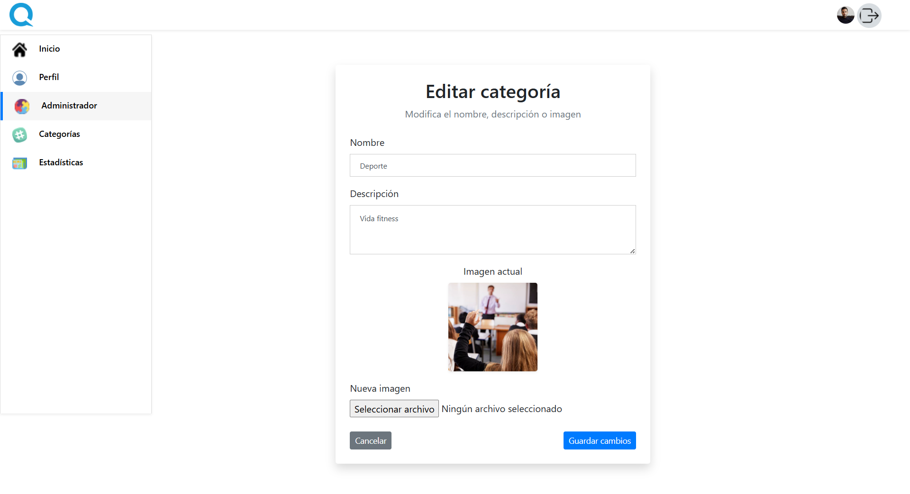

> This page allows the admin to edit specific data from a existing category.

#### **10. Category Page**

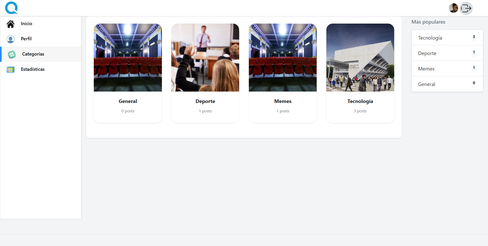

> This page shows existing categories and the number of posts each of them has. When cliked, the image redirects to a page where only the posts of that category are shown.

---

## 🛠 **Práctica 1: Web con HTML generado en servidor y AJAX**

### **Vídeo de Demostración**
📹 **[Enlace al vídeo en YouTube](https://www.youtube.com/watch?v=x91MPoITQ3I)](https://youtu.be/0gTMMrFujZE)**
> Vídeo mostrando las principales funcionalidades de la aplicación web.

### **Execution Instructions**

#### **Prerequisites**
- **Java**: version 21 or higher
- **Maven**: version 21 or higher
- **MySQL**: version 8.0 or higher
- **Git**: to clone the repository

#### **Steps to execute the application**

1. **Clone the repository**
   ```bash
   git clone https://github.com/CodeURJC-DAW-2025-26/practica-daw-2025-26-grupo-9.git
   cd practica-daw-2025-26-grupo-9
   ```
2. **It is recomended to install Java, Maven and Spring Boot extensions in VSCode.**
3. **Download MySQL and MySQL Workbench (use "password" as your password). Create a schema named "equis".**
4. **Execute the code.**
5. **Introduce this URL in your browser (it will tell you its not secure, ignore it): https://localhost:8443/**

#### **Test credentials**
- **Admin user**: usuario: `admin@equis.com`, contraseña: `admin`
- **Registered user**: usuario: `user@equis.com`, contraseña: `user`

### **Database Entities Diagram**

Entity-Relationship diagram showing entities, attributes, and relationships:


### **Templates and Class Diagram**

Application class diagram with differentiation by colors:

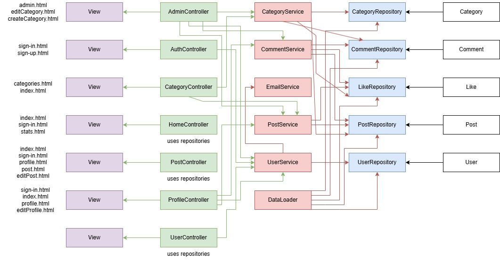

### **Participación de Miembros en la Práctica 1**

#### **Alumno 1 - [David Paul Limaylla Ticlavilca]**

[Levantar la bbdd y funcionalidades del administrador (bloquear usuario, eliminar post, eliminar comentario, crear categoria, editar categoria, eliminar categoria) - (categorias y post) views user]

| Nº    | Commits      | Files      |
|:------------: |:------------:| :------------:|
|1| [admin option added - category/users images loaded](https://github.com/CodeURJC-DAW-2025-26/practica-daw-2025-26-grupo-9/commit/a8de5af018e1076f4465e934b9f7788ee0a052d3)  | [AdminController](https://github.com/CodeURJC-DAW-2025-26/practica-daw-2025-26-grupo-9/commit/a8de5af018e1076f4465e934b9f7788ee0a052d3#diff-d377b68ab6e6f136a5136f6bf045b57c85a6c1bf0e507afb757e1e49b6c29bae)   |
|2| [entities updated and properties to run database, dataloader](https://github.com/CodeURJC-DAW-2025-26/practica-daw-2025-26-grupo-9/commit/92dd6eb79894af0e0b4572d6658ee68cdc1193d1)  | [DataLoader.java](https://github.com/CodeURJC-DAW-2025-26/practica-daw-2025-26-grupo-9/commit/92dd6eb79894af0e0b4572d6658ee68cdc1193d1#diff-6e0714325580c329886beb90a7071653f93d4afd9ff1d90a5ea78cd2e19caa57)   |
|3| [post view added - return safePath method added](https://github.com/CodeURJC-DAW-2025-26/practica-daw-2025-26-grupo-9/commit/7ba9811223dd2819749310bb9952de337b81db66)  | [PostController.java](https://github.com/CodeURJC-DAW-2025-26/practica-daw-2025-26-grupo-9/commit/7ba9811223dd2819749310bb9952de337b81db66#diff-0da083eb305b2939c35d4c6d4bb11d3c63b8af5fecd980cbafde538a7f3bdca7)   |
|4| [admin can delete from admin's page](https://github.com/CodeURJC-DAW-2025-26/practica-daw-2025-26-grupo-9/commit/20f26b7ac3a2e417d4ff11c5367dfda97c692ff0)  | [AdminController.java](https://github.com/CodeURJC-DAW-2025-26/practica-daw-2025-26-grupo-9/commit/20f26b7ac3a2e417d4ff11c5367dfda97c692ff0#diff-d377b68ab6e6f136a5136f6bf045b57c85a6c1bf0e507afb757e1e49b6c29bae)   |
|5| [categories page fixed - image problem solved](https://github.com/CodeURJC-DAW-2025-26/practica-daw-2025-26-grupo-9/commit/69ecbd057ad157858ee5386b787cd9c7b230b4cb)  | [CategoryService.java](https://github.com/CodeURJC-DAW-2025-26/practica-daw-2025-26-grupo-9/commit/69ecbd057ad157858ee5386b787cd9c7b230b4cb#diff-cded6e6896208787d6638e09428efe71138f30e4fbf2f26c5cf463a0e45a3935)   |

---

#### **Alumno 2 - [Elena Ceinos abeijón]**

[Descripción de las tareas y responsabilidades principales del alumno en el proyecto]

| Nº    | Commits      | Files      |
|:------------: |:------------:| :------------:|
|1| [Levantar Spring con maven](https://github.com/CodeURJC-DAW-2025-26/daw-2025-26-project-base/commit/3a0f64a0b60036c0c6c0fd1290d7f4bd01a0a6ac)  | [backend](https://github.com/CodeURJC-DAW-2025-26/practica-daw-2025-26-grupo-9/tree/main/backend/equis)   |
|2| [Basic controllers,security and mustache ](https://github.com/CodeURJC-DAW-2025-26/daw-2025-26-project-base/commit/23b5eceb13a154a57b792596d9ffdb5445b85833) | [security](https://github.com/CodeURJC-DAW-2025-26/practica-daw-2025-26-grupo-9/tree/main/backend/equis/src/main/java/es/urjc/daw/equis/security)   |
|3| [Encrypted pass](https://github.com/CodeURJC-DAW-2025-26/daw-2025-26-project-base/commit/be05b165ff4c1d0cfbe4aa4f386233c9d611aa3e)  | [AuthController](https://github.com/CodeURJC-DAW-2025-26/practica-daw-2025-26-grupo-9/blob/main/backend/equis/src/main/java/es/urjc/daw/equis/controller/AuthController.java)   |
|4| [User controller to use service instead of repo](https://github.com/CodeURJC-DAW-2025-26/daw-2025-26-project-base/commit/0baab265c178a8b0e252e9ffb92f46c637d88a82)  | [UserController](https://github.com/CodeURJC-DAW-2025-26/practica-daw-2025-26-grupo-9/blob/main/backend/equis/src/main/java/es/urjc/daw/equis/controller/UserController.java)   |
|5| [Keystore and port changed](https://github.com/CodeURJC-DAW-2025-26/daw-2025-26-project-base/commit/a18f80a9da77da081ad270afb3943a83a49cac93)  | [keystore.p12](https://github.com/CodeURJC-DAW-2025-26/practica-daw-2025-26-grupo-9/blob/main/backend/equis/src/main/resources/keystore.p12)   |

---

#### **Alumno 3 - Alvaro Sepúlveda Crespo**

Implemetacion del la tecnologia avanzada(grafico), algoritmo de ordenacion, comentarios y categorias.

| Nº    | Commits      | Files      |
|:------------: |:------------:| :------------:|
|1| Algoritmo de ordenacion de post (https://github.com/CodeURJC-DAW-2025-26/daw-2025-26-project-base/commit/653ddbbe04218c0b467e5d8ec2feaad85deeaa95)  | [Archivo1](URL_archivo_1)   |
|2| Home controller changes for chart(https://github.com/CodeURJC-DAW-2025-26/daw-2025-26-project-base/commit/a57771f9d4e0df223c44ef26f44be4ffaa1996c0)  | [Archivo2](URL_archivo_2)   |
|3| Controller changes for comments(https://github.com/CodeURJC-DAW-2025-26/daw-2025-26-project-base/commit/49cdb7942b2bab35629a7d5b431c15c0107f72ea)  | [Archivo3](URL_archivo_3)   |
|4| Global controller advice change for categories(https://github.com/CodeURJC-DAW-2025-26/daw-2025-26-project-base/commit/49cdb7942b2bab35629a7d5b431c15c0107f72ea)  | [Archivo4](URL_archivo_4)   |
|5| fix for categories controller(https://github.com/CodeURJC-DAW-2025-26/practica-daw-2025-26-grupo-9/commit/aae11f368baef394a5af3c06e8cee4ca2bc21a32)  | [Archivo5](URL_archivo_5)   |

---

#### **Student 4 - Sergio Rodríguez Gil**

In addition to general improvements, I was responsible for implementing the like functionality, anonymous user support, and the email notification system triggered upon user registration.

| Nº    | Commits      | Files      |
|:------------: |:------------:| :------------:|
|1| [Implement email when registering](https://github.com/CodeURJC-DAW-2025-26/practica-daw-2025-26-grupo-9/commit/2a47bb86e06fd37659b784adb9d0512229784960)  | [EmailService.java](https://github.com/CodeURJC-DAW-2025-26/practica-daw-2025-26-grupo-9/blob/main/backend/equis/src/main/java/es/urjc/daw/equis/service/EmailService.java)   |
|2| [Implemented anonymous user functionalities](https://github.com/CodeURJC-DAW-2025-26/practica-daw-2025-26-grupo-9/commit/b759f7955bc4381611a7ad08ce3624b71207877b)  | [HomeController.java](https://github.com/CodeURJC-DAW-2025-26/practica-daw-2025-26-grupo-9/blob/main/backend/equis/src/main/java/es/urjc/daw/equis/controller/HomeController.java)   |
|3| [Create PostController](https://github.com/CodeURJC-DAW-2025-26/practica-daw-2025-26-grupo-9/commit/23df9ec1ac04559ee73aa56b1c7c087546eabd49)  | [PostController.java](https://github.com/CodeURJC-DAW-2025-26/practica-daw-2025-26-grupo-9/blob/main/backend/equis/src/main/java/es/urjc/daw/equis/controller/PostController.java)   |
|4| [Create LikeRepository.java](https://github.com/CodeURJC-DAW-2025-26/practica-daw-2025-26-grupo-9/commit/92ca883afdc37f2eb7cdb490285bca0dfa8f9fbc)  | [welcome.html](https://github.com/CodeURJC-DAW-2025-26/practica-daw-2025-26-grupo-9/blob/main/backend/equis/src/main/resources/templates/welcome.html)   |
|5| [Create like entity](https://github.com/CodeURJC-DAW-2025-26/practica-daw-2025-26-grupo-9/commit/de5cf7c223372dbe743bb82c318eab982ba77077)  | [Like.java](https://github.com/CodeURJC-DAW-2025-26/practica-daw-2025-26-grupo-9/blob/main/backend/equis/src/main/java/es/urjc/daw/equis/model/Like.java)   |

#### **Alumno 5 - Cassiel Seth Mayorca Heirisman**

Creacion e interrelacion de entidades, gestion de imagenes, creacion y edicion de posts

| Nº    | Commits      | Files      |
|:------------: |:------------:| :------------:|
|1| [Editar Post y visualizacion de imagen](https://github.com/CodeURJC-DAW-2025-26/practica-daw-2025-26-grupo-9/commit/5845b536cdf1ee1fafc0c0c47cc8fe10c8b8e743)  | [PostController.java](https://github.com/CodeURJC-DAW-2025-26/practica-daw-2025-26-grupo-9/blob/main/backend/equis/src/main/java/es/urjc/daw/equis/controller/PostController.java)   |
|2| [Implementacion newPost y gestion de imagen](https://github.com/CodeURJC-DAW-2025-26/practica-daw-2025-26-grupo-9/commit/3e16baf0e8efb30284e0079deb22f85621903c05)  | [PostController.java](https://github.com/CodeURJC-DAW-2025-26/practica-daw-2025-26-grupo-9/blob/main/backend/equis/src/main/java/es/urjc/daw/equis/controller/PostController.java)   |
|3| [Relacion de entidades](https://github.com/CodeURJC-DAW-2025-26/practica-daw-2025-26-grupo-9/commit/e96a3b75da1fa9941ad71cb426e20e2042d6b2e4)  | [Category.java](https://github.com/CodeURJC-DAW-2025-26/practica-daw-2025-26-grupo-9/blob/main/backend/equis/src/main/java/es/urjc/daw/equis/model/Category.java) [Comment.java](https://github.com/CodeURJC-DAW-2025-26/practica-daw-2025-26-grupo-9/blob/main/backend/equis/src/main/java/es/urjc/daw/equis/model/User.java)    |
|4| [Creacion category y comment](https://github.com/CodeURJC-DAW-2025-26/practica-daw-2025-26-grupo-9/commit/982e003380405c03ea203789bd38933cf0a9294f)  | [Category.java](https://github.com/CodeURJC-DAW-2025-26/practica-daw-2025-26-grupo-9/blob/main/backend/equis/src/main/java/es/urjc/daw/equis/model/Category.java) [Comment.java](https://github.com/CodeURJC-DAW-2025-26/practica-daw-2025-26-grupo-9/blob/main/backend/equis/src/main/java/es/urjc/daw/equis/model/Comment.java)  |
|5| [Borrar post como usuario](https://github.com/CodeURJC-DAW-2025-26/practica-daw-2025-26-grupo-9/commit/9c680ac9f2f1669d0ae2148f9489252d3c2892b6)  | [PostController.java](https://github.com/CodeURJC-DAW-2025-26/practica-daw-2025-26-grupo-9/blob/main/backend/equis/src/main/java/es/urjc/daw/equis/controller/PostController.java)   |


---

## 🛠 **Práctica 2: Incorporación de una API REST a la aplicación web, despliegue con Docker y despliegue remoto**

### **Vídeo de Demostración**
📹 **[Enlace al vídeo en YouTube](https://www.youtube.com/watch?v=x91MPoITQ3I)**
> Vídeo mostrando las principales funcionalidades de la aplicación web.

### **Documentación de la API REST**

#### **Especificación OpenAPI**
📄 **[Especificación OpenAPI (YAML)](/api-docs/api-docs.yaml)**

#### **Documentación HTML**
📖 **[Documentación API REST (HTML)](https://raw.githack.com/[usuario]/[repositorio]/main/api-docs/api-docs.html)**

> La documentación de la API REST se encuentra en la carpeta `/api-docs` del repositorio. Se ha generado automáticamente con SpringDoc a partir de las anotaciones en el código Java.

### **Updated Templates and Class Diagram**

Updated diagram including the @RestController components and their relationship with the shared @Service layers:

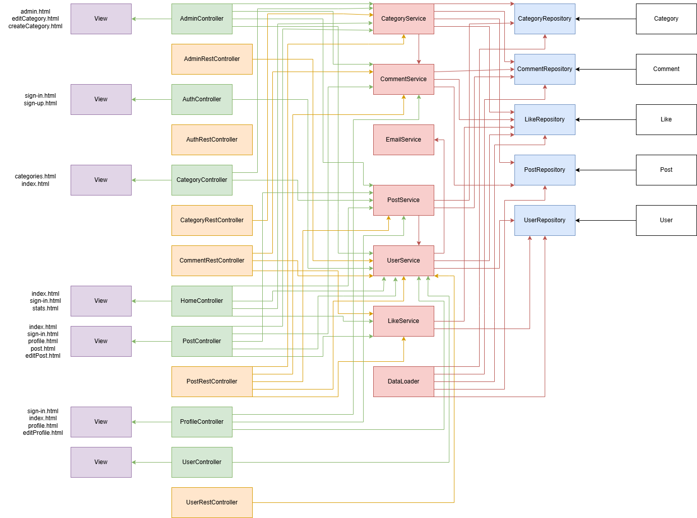

### **Docker Building and Execution Instructions**

#### **Prerequisites:**
- Docker installed (version 20.10 or higher)
- Docker Compose installed (version 2.0 or higher)

#### **Steps if you want to deploy it yourself:**

1. **Clone the repository** (if you haven’t already):
   ```bash
   git clone https://github.com/CodeURJC-DAW-2025-26/practica-daw-2025-26-grupo-9.git
   cd practica-daw-2025-26-grupo-9
   ```
2. **Login in your docker account**:
   ```bash
   docker login
   ```

3. **Build the Docker image**:
   ```bash
   ./docker/create_image.sh [your_docker_user_name]/equisdaw
   ```

4. **Publish the Docker image**:
   ```bash
   ./docker/publish_image.sh [your_docker_user_name]/equisdaw
   ```

5. **Publish the Docker Compose**:
   ```bash
   ./docker/publish_docker-compose.sh [your_docker_user_name]/equisdaw-compose [your_docker_user_name]/equisdaw
   ```

6. **Start containers locally**:
   ```bash
   docker compose -f docker/docker-compose.yml up
   ```

**If it fails in one of the steps, try changing the DOCKER_IMAGE=[your_docker_user_name]/equisdaw:latest variable, so that it includes your docker user.**

#### **Steps if you want to download the OCI artifact directly from Docker Hub:**

1. **Download and execute the app**:
   ```bash
   docker compose -f oci://docker.io/neokyouma/equisdaw-compose:latest up
   ```
   
**You may additionally need to export some environment variables for the previous step to work**
   ```bash
   export DOCKER_IMAGE=neokyouma/equisdaw:latest
   export DB_NAME=equis
   export DB_USERNAME=root
   export DB_PASSWORD=password
   export DDL_AUTO=update
   export APP_LOAD_SAMPLE_DATA=true
   ```

### **Despliegue en Máquina Virtual**

#### **Requisitos:**
- Acceso a la máquina virtual (SSH)
- Clave privada para autenticación
- Conexión a la red correspondiente o VPN configurada

#### **Pasos para desplegar:**

1. **Conectar a la máquina virtual**:
   ```bash
   ssh -i [ruta/a/clave.key] [usuario]@[IP-o-dominio-VM]
   ```
   
   Ejemplo:
   ```bash
   ssh -i ssh-keys/app.key vmuser@10.100.139.XXX
   ```

2. **AQUÍ LOS SIGUIENTES PASOS**:

### **URL de la Aplicación Desplegada**

🌐 **URL de acceso**: `https://[nombre-app].etsii.urjc.es:8443`

#### **Credenciales de Usuarios de Ejemplo**

| Rol | User | Password |
|:---|:---|:---|
| Admin | admin@equis.com | admin |
| Registered User 1 | user@equis.com | user |
| Registered User 2 | maria@equis.com | 1234 |
| Registered User 3 | carlos@equis.com | 1234 |

### **Participación de Miembros en la Práctica 2**

#### **Alumno 1 - [Nombre Completo]**

[Descripción de las tareas y responsabilidades principales del alumno en el proyecto]

| Nº    | Commits      | Files      |
|:------------: |:------------:| :------------:|
|1| [Descripción commit 1](URL_commit_1)  | [Archivo1](URL_archivo_1)   |
|2| [Descripción commit 2](URL_commit_2)  | [Archivo2](URL_archivo_2)   |
|3| [Descripción commit 3](URL_commit_3)  | [Archivo3](URL_archivo_3)   |
|4| [Descripción commit 4](URL_commit_4)  | [Archivo4](URL_archivo_4)   |
|5| [Descripción commit 5](URL_commit_5)  | [Archivo5](URL_archivo_5)   |

---

#### **Alumno 2 - [Elena Ceinos abeijón]**

[Descripción de las tareas y responsabilidades principales del alumno en el proyecto]

| Nº    | Commits      | Files      |
|:------------: |:------------:| :------------:|
|1| [Add custom error handler](https://github.com/CodeURJC-DAW-2025-26/practica-daw-2025-26-grupo-9/tree/b80b0b4cae2b4f88cadf5718fca63da468834e9d)  | [CustomErrorController](https://github.com/CodeURJC-DAW-2025-26/practica-daw-2025-26-grupo-9/commit/b80b0b4cae2b4f88cadf5718fca63da468834e9d#diff-a666edbe0225b19137ddf5bcff61c40f33cd7de3271189d686a26b32622401a0)   |
|2| [user rest endpoints ](https://github.com/CodeURJC-DAW-2025-26/practica-daw-2025-26-grupo-9/tree/fcc66545c80cffc962804a0fffbae71d5786d29c) | [UserRestController](https://github.com/CodeURJC-DAW-2025-26/practica-daw-2025-26-grupo-9/blob/fcc66545c80cffc962804a0fffbae71d5786d29c/backend/equis/src/main/java/es/urjc/daw/equis/controller/UserRestController.java)   |
|3| [Block users api](https://github.com/CodeURJC-DAW-2025-26/practica-daw-2025-26-grupo-9/tree/dd8a51e9cfa980f473f09b9017bd33eef8125a6c)  | [AdminRestController](https://github.com/CodeURJC-DAW-2025-26/practica-daw-2025-26-grupo-9/blob/dd8a51e9cfa980f473f09b9017bd33eef8125a6c/backend/equis/src/main/java/es/urjc/daw/equis/controller/AdminRestController.java)   |
|4| [Modified service to work with api](https://github.com/CodeURJC-DAW-2025-26/practica-daw-2025-26-grupo-9/tree/dd8a51e9cfa980f473f09b9017bd33eef8125a6c/backend/equis)  | [UserService](https://github.com/CodeURJC-DAW-2025-26/practica-daw-2025-26-grupo-9/blob/main/backend/equis/src/main/java/es/urjc/daw/equis/service/UserService.java)   |
|5| [Added endpoints to api docs](https://github.com/CodeURJC-DAW-2025-26/practica-daw-2025-26-grupo-9/commit/dd8a51e9cfa980f473f09b9017bd33eef8125a6c)  | [eQuis.postman.collection](https://github.com/CodeURJC-DAW-2025-26/practica-daw-2025-26-grupo-9/blob/main/backend/equis/api-docs/eQuis.postman_collection.json)   |

---

#### **Alumno 3 - [Nombre Completo]**

[Descripción de las tareas y responsabilidades principales del alumno en el proyecto]

| Nº    | Commits      | Files      |
|:------------: |:------------:| :------------:|
|1| [Descripción commit 1](URL_commit_1)  | [Archivo1](URL_archivo_1)   |
|2| [Descripción commit 2](URL_commit_2)  | [Archivo2](URL_archivo_2)   |
|3| [Descripción commit 3](URL_commit_3)  | [Archivo3](URL_archivo_3)   |
|4| [Descripción commit 4](URL_commit_4)  | [Archivo4](URL_archivo_4)   |
|5| [Descripción commit 5](URL_commit_5)  | [Archivo5](URL_archivo_5)   |

---

#### **Student 4 - Sergio Rodríguez Gil**

In addition to general tasks such as adding requests to the Postman collection, assisting with Docker-related tasks, and creating DTOs and mappers, I was responsible for implementing API operations related to posts and comments.

| Nº    | Commits      | Files      |
|:------------: |:------------:| :------------:|
|1| [Add api operations for comment](https://github.com/CodeURJC-DAW-2025-26/practica-daw-2025-26-grupo-9/commit/b436a6745ca55fb7e41fea3503862a3d03bfc4a2) | [CommentRestController.java](https://github.com/CodeURJC-DAW-2025-26/practica-daw-2025-26-grupo-9/blob/main/backend/equis/src/main/java/es/urjc/daw/equis/controller/CommentRestController.java)   |
|2| [Implement POST and PUT Post](https://github.com/CodeURJC-DAW-2025-26/practica-daw-2025-26-grupo-9/commit/132cd88f46515c37992a9d929789cd12c51a226e) | [PostRestController.java](https://github.com/CodeURJC-DAW-2025-26/practica-daw-2025-26-grupo-9/blob/main/backend/equis/src/main/java/es/urjc/daw/equis/controller/PostRestController.java)   |
|3| [Implemented some Post operations in api](https://github.com/CodeURJC-DAW-2025-26/practica-daw-2025-26-grupo-9/commit/5a43af9820c1cf58b3bfc11e6c88b98def7e4ad0) | [PostService.java](https://github.com/CodeURJC-DAW-2025-26/practica-daw-2025-26-grupo-9/blob/main/backend/equis/src/main/java/es/urjc/daw/equis/service/PostService.java)   |
|4| [Add api operation to like and dislike](https://github.com/CodeURJC-DAW-2025-26/practica-daw-2025-26-grupo-9/commit/451b4a749a05a9f5a4707c4fe8c85b0d5e40e0eb) | [PostRepository.java](https://github.com/CodeURJC-DAW-2025-26/practica-daw-2025-26-grupo-9/blob/main/backend/equis/src/main/java/es/urjc/daw/equis/repository/PostRepository.java)   |
|5| [Statistics operation in api](https://github.com/CodeURJC-DAW-2025-26/practica-daw-2025-26-grupo-9/commit/3a486db6e13a49e126e16949dc535f7c69492451) | [PostMapper.java](https://github.com/CodeURJC-DAW-2025-26/practica-daw-2025-26-grupo-9/blob/main/backend/equis/src/main/java/es/urjc/daw/equis/dto/PostMapper.java)   |

---

## 🛠 **Práctica 3: Implementación de la web con arquitectura SPA**

### **Vídeo de Demostración**
📹 **[Enlace al vídeo en YouTube](URL_del_video)**
> Vídeo mostrando las principales funcionalidades de la aplicación web.

### **Preparación del Entorno de Desarrollo**

#### **Requisitos Previos**
- **Node.js**: versión 18.x o superior
- **npm**: versión 9.x o superior (se instala con Node.js)
- **Git**: para clonar el repositorio

#### **Pasos para configurar el entorno de desarrollo**

1. **Instalar Node.js y npm**
   
   Descarga e instala Node.js desde [https://nodejs.org/](https://nodejs.org/)
   
   Verifica la instalación:
   ```bash
   node --version
   npm --version
   ```

2. **Clonar el repositorio** (si no lo has hecho ya)
   ```bash
   git clone https://github.com/[usuario]/[nombre-repositorio].git
   cd [nombre-repositorio]
   ```

3. **Navegar a la carpeta del proyecto React**
   ```bash
   cd frontend
   ```

4. **AQUÍ LOS SIGUIENTES PASOS**

### **Diagrama de Clases y Templates de la SPA**

Diagrama mostrando los componentes React, hooks personalizados, servicios y sus relaciones:


### **Participación de Miembros en la Práctica 3**

#### **Alumno 1 - [Nombre Completo]**

[Descripción de las tareas y responsabilidades principales del alumno en el proyecto]

| Nº    | Commits      | Files      |
|:------------: |:------------:| :------------:|
|1| [Descripción commit 1](URL_commit_1)  | [Archivo1](URL_archivo_1)   |
|2| [Descripción commit 2](URL_commit_2)  | [Archivo2](URL_archivo_2)   |
|3| [Descripción commit 3](URL_commit_3)  | [Archivo3](URL_archivo_3)   |
|4| [Descripción commit 4](URL_commit_4)  | [Archivo4](URL_archivo_4)   |
|5| [Descripción commit 5](URL_commit_5)  | [Archivo5](URL_archivo_5)   |

---

#### **Alumno 2 - [Nombre Completo]**

[Descripción de las tareas y responsabilidades principales del alumno en el proyecto]

| Nº    | Commits      | Files      |
|:------------: |:------------:| :------------:|
|1| [Descripción commit 1](URL_commit_1)  | [Archivo1](URL_archivo_1)   |
|2| [Descripción commit 2](URL_commit_2)  | [Archivo2](URL_archivo_2)   |
|3| [Descripción commit 3](URL_commit_3)  | [Archivo3](URL_archivo_3)   |
|4| [Descripción commit 4](URL_commit_4)  | [Archivo4](URL_archivo_4)   |
|5| [Descripción commit 5](URL_commit_5)  | [Archivo5](URL_archivo_5)   |

---

#### **Alumno 3 - [Nombre Completo]**

[Descripción de las tareas y responsabilidades principales del alumno en el proyecto]

| Nº    | Commits      | Files      |
|:------------: |:------------:| :------------:|
|1| [Descripción commit 1](URL_commit_1)  | [Archivo1](URL_archivo_1)   |
|2| [Descripción commit 2](URL_commit_2)  | [Archivo2](URL_archivo_2)   |
|3| [Descripción commit 3](URL_commit_3)  | [Archivo3](URL_archivo_3)   |
|4| [Descripción commit 4](URL_commit_4)  | [Archivo4](URL_archivo_4)   |
|5| [Descripción commit 5](URL_commit_5)  | [Archivo5](URL_archivo_5)   |

---

#### **Alumno 4 - [Nombre Completo]**

[Descripción de las tareas y responsabilidades principales del alumno en el proyecto]

| Nº    | Commits      | Files      |
|:------------: |:------------:| :------------:|
|1| [Descripción commit 1](URL_commit_1)  | [Archivo1](URL_archivo_1)   |
|2| [Descripción commit 2](URL_commit_2)  | [Archivo2](URL_archivo_2)   |
|3| [Descripción commit 3](URL_commit_3)  | [Archivo3](URL_archivo_3)   |
|4| [Descripción commit 4](URL_commit_4)  | [Archivo4](URL_archivo_4)   |
|5| [Descripción commit 5](URL_commit_5)  | [Archivo5](URL_archivo_5)   |

